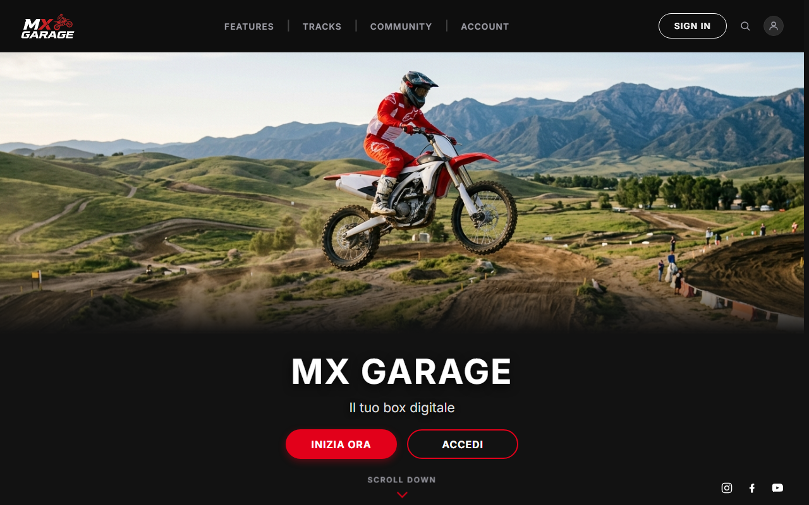
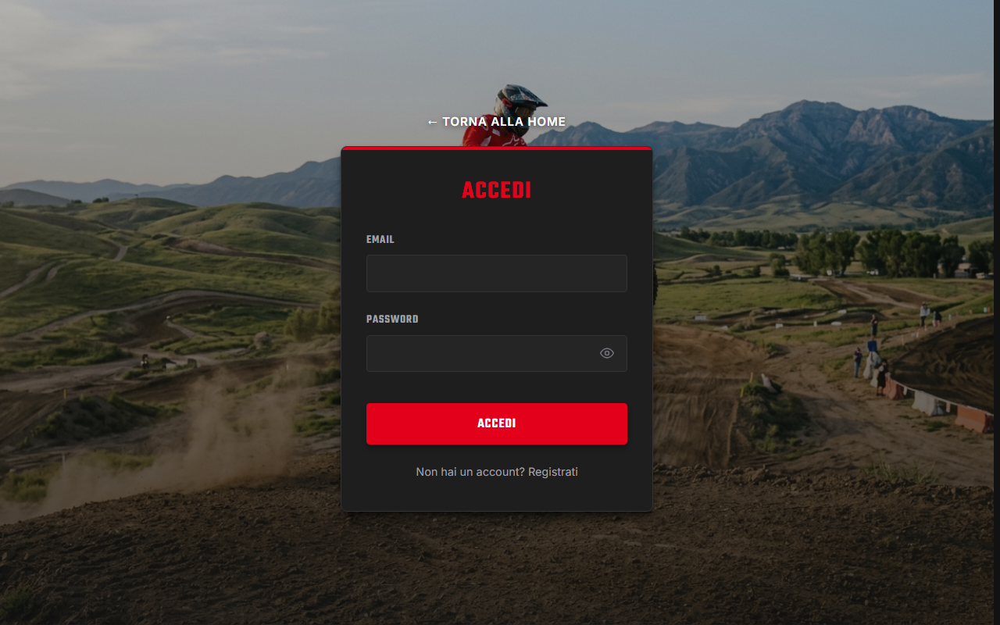
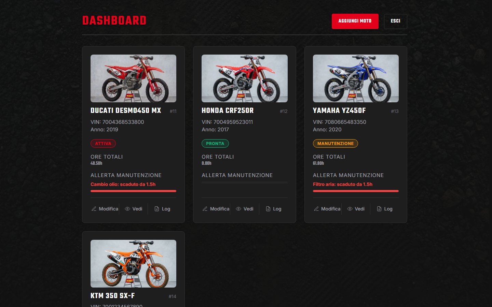
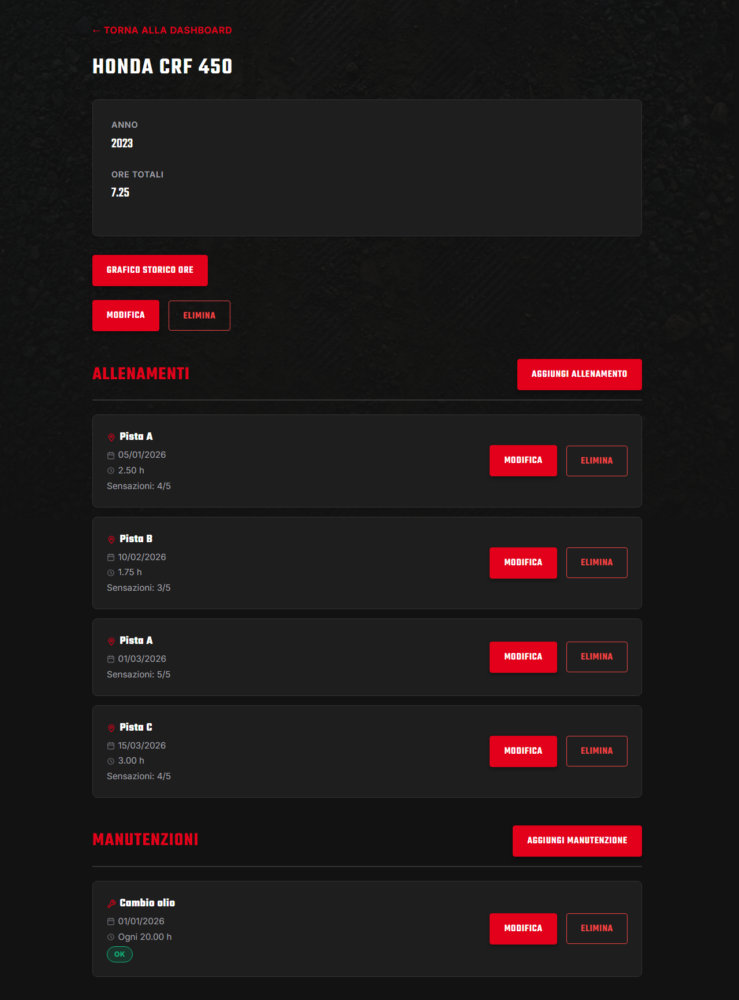
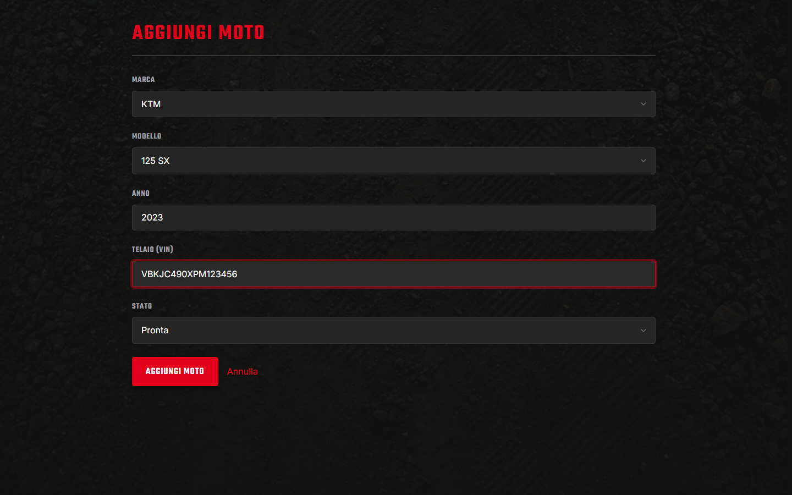
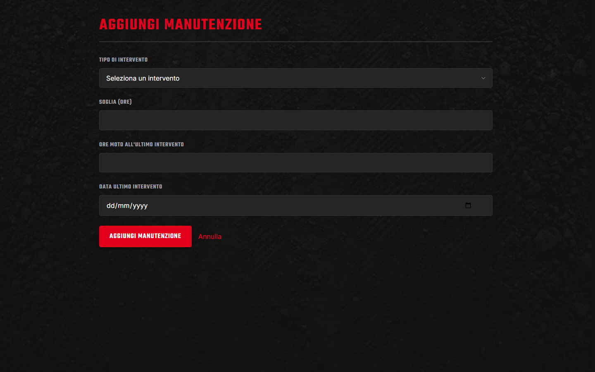
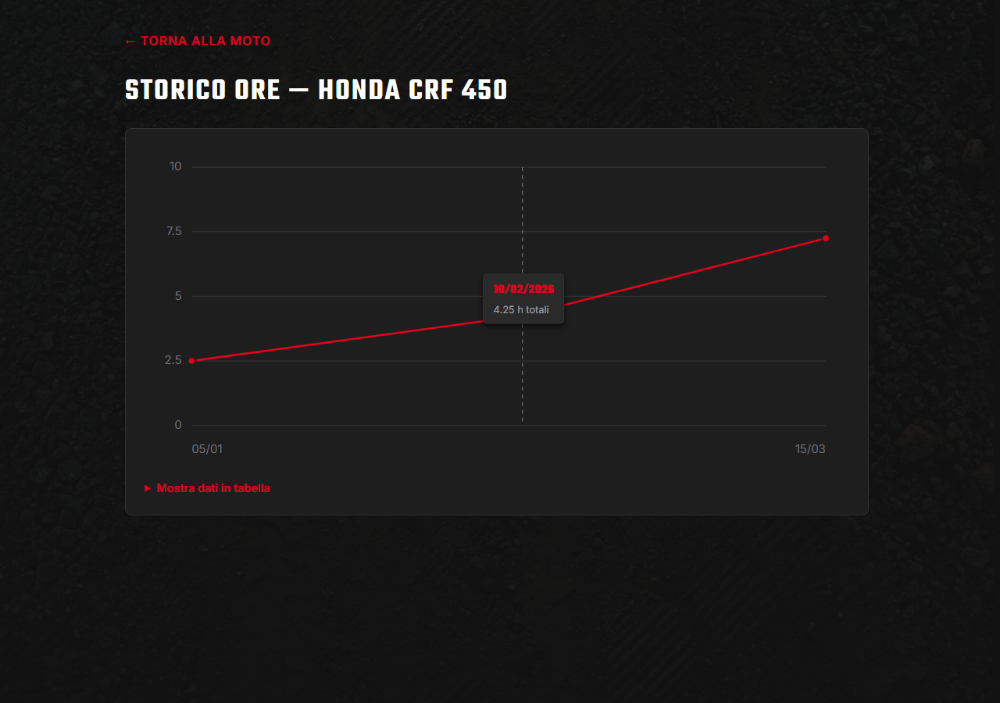
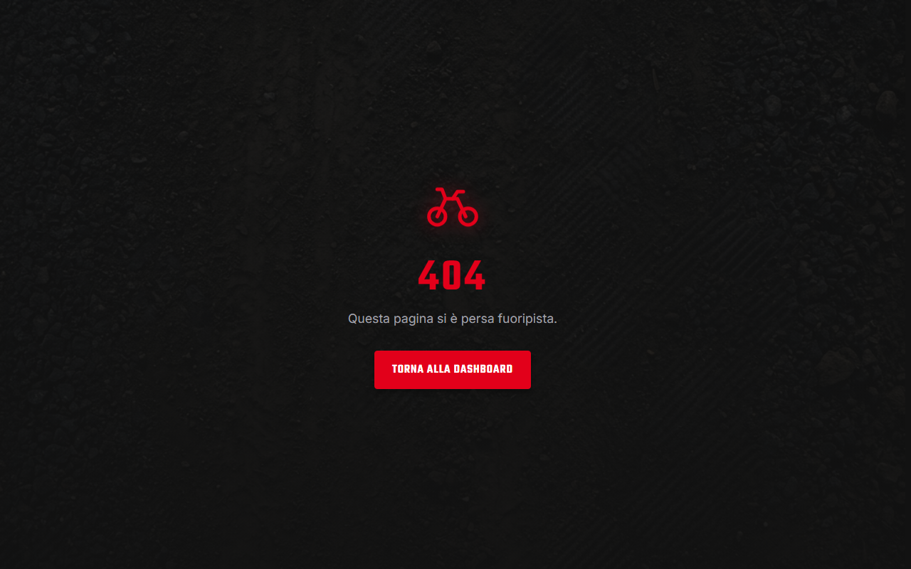

# MX Track & Bike Manager

> ⚠️ **Progetto in fase di sviluppo (work in progress).** Le funzionalità, le API e lo schema del database possono cambiare senza preavviso. Non utilizzare in produzione.

> 📚 Questo è un progetto personale realizzato a scopo di allenamento/apprendimento, per esercitarmi con Node.js, Express e MySQL.

Applicazione per la gestione di moto da cross/enduro, sessioni in pista e manutenzioni programmate: backend REST (Express + MySQL) e frontend React in sviluppo. Permette a ogni utente di tracciare le proprie moto, registrare le sessioni di guida (pista, meteo, ore, sensazioni) e tenere sotto controllo le scadenze di manutenzione in base alle ore di utilizzo.

## Stato del progetto

### Backend

| Modulo | Stato |
|---|---|
| Autenticazione utenti (registrazione, login, JWT) | ✅ Implementato |
| Gestione moto (bikes) | ✅ Implementato |
| Sessioni in pista (sessions) | ✅ Implementato |
| Manutenzioni programmate (maintenance) | ✅ Implementato |
| Alert di manutenzione (ore rimanenti, stato ok / in scadenza / scaduta) | ✅ Implementato |
| Middleware di autorizzazione sulle rotte protette | ✅ Implementato |
| Validazione input (login, moto, sessioni, manutenzioni), normalizzazione email | ✅ Implementato |

### Frontend

| Modulo | Stato |
|---|---|
| Scaffolding React + Vite, routing (`react-router-dom`) | ✅ Implementato |
| Pagina di registrazione (form, validazione client, chiamata API, gestione errori, accessibilità) | ✅ Implementato |
| Route 404 di fallback | ✅ Implementato |
| Storage del token e auto-attach alle richieste API, contesto di autenticazione (`AuthContext`/`useAuth`) | ✅ Implementato |
| Chiamata API di login (`authApi.login`) | ✅ Implementato |
| Pagina di login | ✅ Implementato |
| Rotte protette (`ProtectedRoute`), redirect al login se non autenticati | ✅ Implementato |
| Dashboard moto (`HomePage`): elenco moto con ore totali e alert manutenzione | ✅ Implementato |
| Gestione garage (creazione, dettaglio, modifica, eliminazione moto) | ✅ Implementato |
| Client API sessioni e manutenzioni (`sessionApi`, `maintenanceApi`) | ✅ Implementato |
| Log sessioni in pista: form di inserimento, storico per moto, modifica ed eliminazione | ✅ Implementato |
| Interfaccia manutenzioni programmate: form di creazione, storico con badge di stato (ok/in scadenza/scaduta), modifica ed eliminazione | ✅ Implementato |
| Landing page pubblica con CTA verso login/registrazione | ✅ Implementato |
| Tema grafico dark motocross (CSS custom properties) e transizioni di pagina animate | ✅ Implementato |
| Pagine login/registrazione con navbar, icone e toggle "Ricordami" (persistenza token in `localStorage` o `sessionStorage`) | ✅ Implementato |
| Classi utility Bootstrap per gli spaziamenti nell'UI | ✅ Implementato |
| Grafico storico ore cumulate per moto (`/bikes/:id/history`) | ✅ Implementato |
| Selezione marca/modello da catalogo predefinito nel form moto (con opzione "altra marca/modello" per valori custom) | ✅ Implementato |
| Immagine della moto in base a marca/modello (card dashboard e dettaglio moto), con icona generica di fallback | ✅ Implementato |
| Campi VIN e stato operativo (attiva/pronta/in manutenzione) nel form moto | ✅ Implementato |
| Card moto in dashboard con badge di stato, VIN, ore totali, barra di allerta manutenzione e azioni rapide (modifica/dettaglio/log) | ✅ Implementato |
| Selezione tipo di intervento da catalogo predefinito nel form manutenzione, con soglia ore suggerita (opzione "altro" per interventi custom) | ✅ Implementato |

## Screenshot

| | |
|---|---|
| **Landing page** | **Login** |
|  |  |
| **Dashboard** | **Dettaglio moto** |
|  |  |
| **Aggiungi moto** | **Aggiungi manutenzione** |
|  |  |
| **Storico ore** | **404** |
|  |  |

## Stack tecnologico

**Backend**
- **Runtime:** Node.js (ESM)
- **Framework:** Express 5 (con `cors` per accettare richieste dal frontend)
- **Database:** MySQL (driver `mysql2`)
- **Autenticazione:** JWT (`jsonwebtoken`) + hashing password con `bcrypt`

**Frontend**
- **Libreria UI:** React 19
- **Build tool:** Vite
- **Routing:** `react-router-dom`
- **Styling:** CSS Modules (tema dark motocross basato su CSS custom properties) + utility class di Bootstrap 5 per gli spaziamenti
- **Animazioni:** `framer-motion` (transizioni tra le pagine)

**Package manager:** pnpm (monorepo con workspaces)

## Struttura del progetto

Monorepo gestito con pnpm workspaces: backend in `apps/backend`, frontend in `apps/frontend`.

```
├── apps/
│   ├── backend/
│   │   ├── config/            # Configurazione connessione al database
│   │   ├── controllers/       # Logica di business delle rotte
│   │   ├── database/          # Schema SQL del database e migrazioni incrementali
│   │   ├── middlewares/       # Middleware Express (auth, autorizzazione, validazione id)
│   │   ├── repositories/      # Query al database, isolate per risorsa
│   │   ├── routes/            # Definizione degli endpoint
│   │   ├── utils/             # Helper condivisi (async handler, risposte API, parsing id)
│   │   ├── server.js          # Entry point dell'applicazione
│   │   └── .env.example       # Esempio di variabili d'ambiente richieste
│   └── frontend/
│       ├── public/            # Asset statici (immagini di sfondo, foto moto per marca, favicon)
│       └── src/
│           ├── components/    # Componenti riusabili (FormField, SelectField, BikeCard, BikeList, BikeForm, SessionForm, MaintenanceForm, ProtectedRoute, RootRoute, PageTransition)
│           ├── context/       # Contesto di autenticazione (AuthContext)
│           ├── data/          # Cataloghi statici (marche/modelli moto, tipi di manutenzione)
│           ├── hooks/         # Hook riusabili (useAuth, useFocusFirstError)
│           ├── pages/         # Pagine/route (LandingPage, RegisterPage, LoginPage, HomePage, AddBikePage, BikeDetailPage, EditBikePage, AddSessionPage, EditSessionPage, AddMaintenancePage, EditMaintenancePage, NotFoundPage)
│           ├── services/      # Client HTTP verso il backend (apiFetch, authApi, bikeApi, sessionApi, maintenanceApi, tokenStorage)
│           ├── utils/         # Funzioni pure riusabili (validatori dei form, calcolo stato manutenzione, immagine moto per marca/modello)
│           ├── App.jsx        # Definizione delle rotte
│           └── main.jsx       # Entry point dell'applicazione
├── package.json        # Root del workspace (script di orchestrazione)
└── pnpm-workspace.yaml  # Definizione dei package del workspace
```

## Requisiti

- Node.js 18+
- pnpm
- Un'istanza MySQL raggiungibile

## Installazione

1. Clona il repository e installa le dipendenze (dalla root del workspace):

   ```bash
   pnpm install
   ```

2. Crea il file `.env` del backend a partire dall'esempio fornito:

   ```bash
   cp apps/backend/.env.example apps/backend/.env
   ```

   Poi valorizza le variabili richieste (vedi tabella sotto).

3. Crea il database ed esegui lo schema SQL:

   ```bash
   mysql -u root -p < apps/backend/database/schema.sql
   ```

   Se il database esiste già da una versione precedente, applica in ordine le migrazioni incrementali in `apps/backend/database/migrations/` invece di ricreare lo schema da zero.

4. Avvia il server (dalla root):

   ```bash
   pnpm start
   ```

   Oppure in modalità sviluppo con auto-reload:

   ```bash
   pnpm watch
   ```

   In alternativa, dalla cartella `apps/backend`, sono disponibili gli script locali `pnpm start` / `pnpm watch`.

5. Avvia il frontend in modalità sviluppo (dalla root):

   ```bash
   pnpm dev
   ```

   Il frontend gira su Vite (`http://localhost:5173` di default) e si aspetta il backend raggiungibile su `http://localhost:3000` di default. Per usare un URL diverso, crea `apps/frontend/.env` a partire da `apps/frontend/.env.example` e valorizza `VITE_API_URL`.

## Variabili d'ambiente

**Backend** (`apps/backend/.env`, da `apps/backend/.env.example`)

| Variabile | Descrizione |
|---|---|
| `PORT` | Porta su cui Express resta in ascolto (default `3000`) |
| `DB_HOST` | Host del database MySQL |
| `DB_PORT` | Porta del database MySQL |
| `DB_USER` | Utente del database |
| `DB_PASSWORD` | Password del database |
| `DB_DATABASE` | Nome del database |
| `JWT_SECRET` | Chiave segreta per firmare/verificare i JWT (generarne una nuova per ogni ambiente) |

**Frontend** (`apps/frontend/.env`, da `apps/frontend/.env.example`)

| Variabile | Descrizione |
|---|---|
| `VITE_API_URL` | URL base del backend REST (default `http://localhost:3000` se non impostata) |

## API disponibili

### Autenticazione (`/auth`)

| Metodo | Endpoint | Descrizione |
|---|---|---|
| `POST` | `/auth/register` | Registra un nuovo utente (`name`, `email`, `password`) |
| `POST` | `/auth/login` | Effettua il login e restituisce un JWT valido 1 ora |

### Moto (`/bike`)

Tutte le rotte richiedono autenticazione (`Authorization: Bearer <token>`). Le rotte su una singola moto (`/:id`) verificano inoltre che la moto appartenga all'utente autenticato.

| Metodo | Endpoint | Descrizione |
|---|---|---|
| `GET` | `/bike` | Elenca le moto dell'utente loggato |
| `GET` | `/bike/:id` | Recupera il dettaglio di una moto (incluso il totale ore) |
| `GET` | `/bike/:id/total-hours` | Totale ore di utilizzo, calcolato sommando le sessioni registrate |
| `GET` | `/bike/:id/alert` | Manutenzioni scadute o in scadenza (entro 10 ore) per la moto |
| `POST` | `/bike` | Crea una nuova moto (`brand`, `model`, `year`, `vin`, `status`) |
| `PUT` | `/bike/:id` | Aggiorna i dati di una moto (`brand`, `model`, `year`, `vin`, `status`) |
| `DELETE` | `/bike/:id` | Elimina una moto |

### Sessioni in pista (`/bike/:id/sessions`)

Tutte le rotte richiedono autenticazione e che la moto (`:id`) appartenga all'utente autenticato. Le rotte su una singola sessione (`/:id/sessions/:id`) verificano inoltre che la sessione appartenga all'utente autenticato.

| Metodo | Endpoint | Descrizione |
|---|---|---|
| `GET` | `/bike/:id/sessions` | Elenca le sessioni registrate per la moto |
| `POST` | `/bike/:id/sessions` | Registra una nuova sessione (`date`, `track`, `weather`, `feeling`, `hours_logged`, `notes`) |
| `PUT` | `/bike/:id/sessions/:id` | Aggiorna i dati di una sessione |
| `DELETE` | `/bike/:id/sessions/:id` | Elimina una sessione |

### Manutenzioni programmate (`/bike/:id/maintenance`)

Tutte le rotte richiedono autenticazione e che la moto (`:id`) appartenga all'utente autenticato. Le rotte su una singola scadenza (`/:id/maintenance/:id`) verificano inoltre che la scadenza appartenga all'utente autenticato.

| Metodo | Endpoint | Descrizione |
|---|---|---|
| `GET` | `/bike/:id/maintenance` | Elenca le scadenze di manutenzione della moto |
| `POST` | `/bike/:id/maintenance` | Registra una nuova scadenza (`task_description`, `hour_threshold`, `last_service_hours`, `service_date`) |
| `PUT` | `/bike/:id/maintenance/:id` | Aggiorna i dati di una scadenza |
| `DELETE` | `/bike/:id/maintenance/:id` | Elimina una scadenza |

## Licenza

ISC
